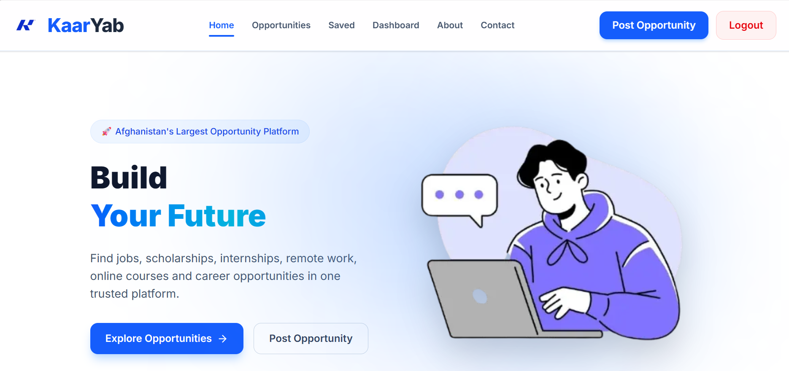
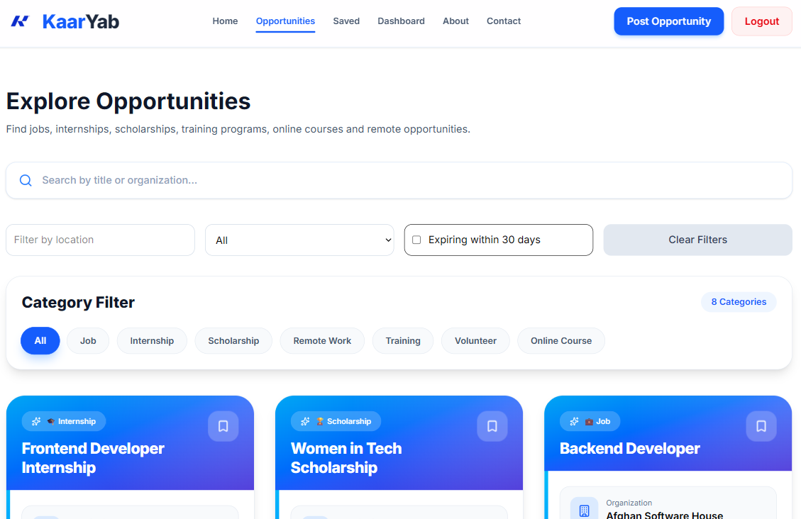
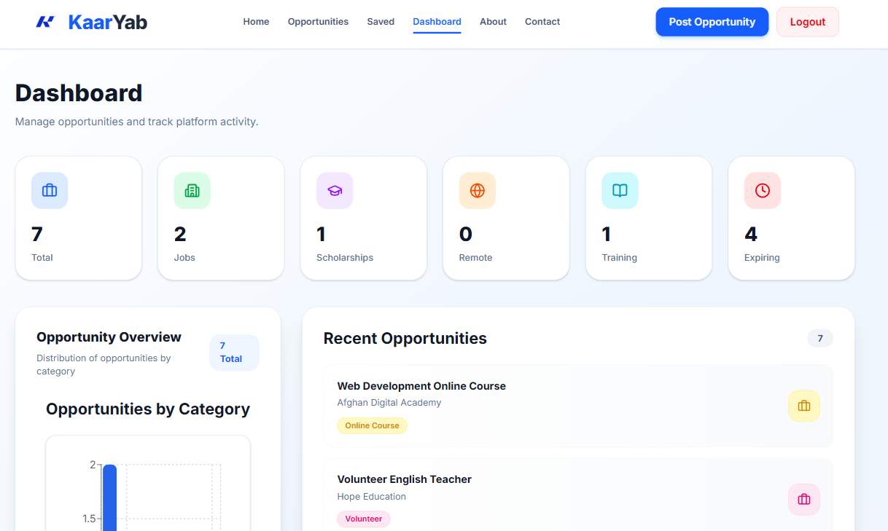
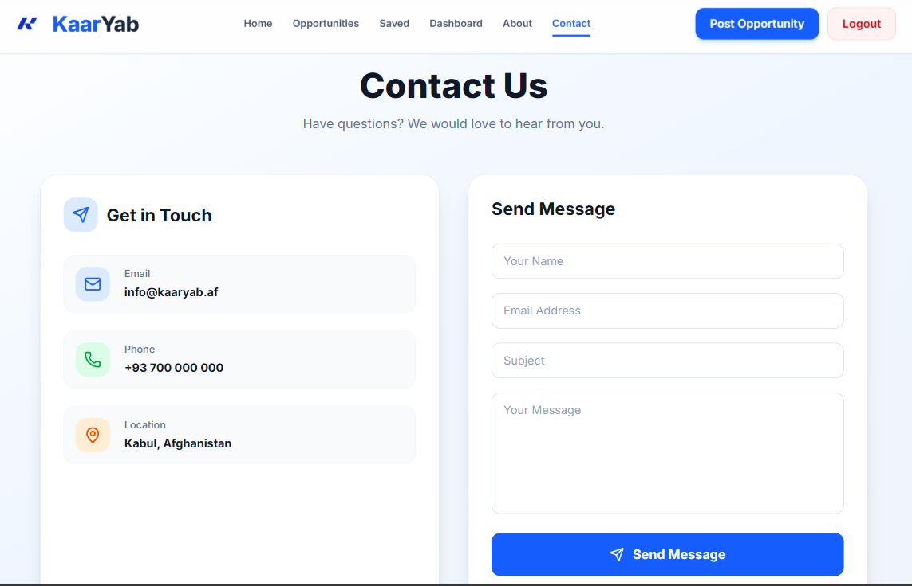
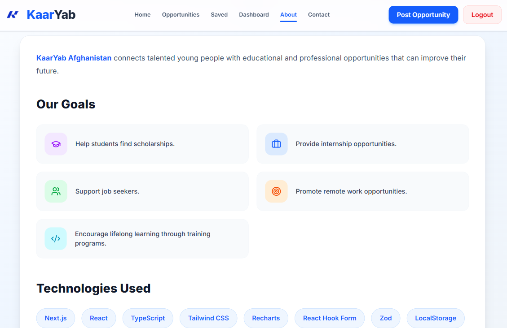
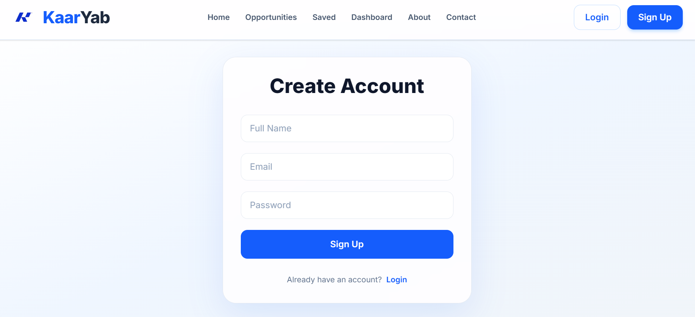

#  KaarYab Afghanistan

KaarYab Afghanistan is a modern opportunity discovery platform designed to help Afghan youth find career and educational opportunities in one trusted place.

The platform connects students, job seekers, and professionals with:

- Jobs
- Internships
- Scholarships
- Remote Work Opportunities
- Training Programs
- Online Courses
- Volunteer Opportunities


---

# 🌐 Live Demo & Repository

| Type | Link |
|------|------|
| Live Website | [https://your-vercel-link.vercel.app](https://kar-yab-app.vercel.app/) |
| Repository | [https://github.com/your-username/karyab](https://github.com/MaryamMirzada/KarYab-App) |


---

# 📸 Screenshots


<table>
  <tr>
    <td align="center">
      <h3>Home Page</h3>
      
    </td>

   <td align="center">
      <h3>Oppertunity Page</h3>
      
    </td>

   <td align="center">
      <h3>Dashboard</h3>
      
    </td>

   <td align="center">
      <h3>Contact</h3>
      
    </td>

  </tr>


  <tr>

   <td align="center">
      <h3>About</h3>
      
    </td>

  <td align="center">
      <h3>Authentication</h3>
      
    </td>

  </tr>

</table>

---

# 🎯 Problem This Project Solves

Many young people struggle to find reliable information about career and educational opportunities.

KaarYab solves this problem by providing:

- A centralized platform for discovering opportunities.
- Easy access to jobs and scholarships.
- A simple system for organizations to share opportunities.
- Better career growth opportunities for Afghan youth.
- A clean and user-friendly experience.


---

# 👥 Target Users

KaarYab is built for:

### Students
- Finding scholarships
- Discovering internships
- Learning new skills

### Job Seekers
- Searching for employment opportunities
- Finding remote jobs
- Improving career growth

### Organizations
- Publishing opportunities
- Reaching talented young people

### Professionals
- Discovering training and development programs


---

# ✨ Features

## 🔍 Opportunity Discovery

Users can explore different opportunity categories:

- Jobs
- Internships
- Scholarships
- Remote Work
- Training
- Volunteer Programs
- Online Courses


## 🔎 Search & Filtering

- Search opportunities by title and organization.
- Filter opportunities by category.
- Quickly find relevant opportunities.


## 🔐 Authentication System

- User registration
- User login
- Protected routes
- User session management


## 📊 Dashboard

Dashboard provides:

- Opportunity statistics
- Category overview
- Recent opportunities
- Platform activity tracking


## ❤️ Saved Opportunities

Users can:

- Save interesting opportunities.
- Access saved opportunities later.


## 📝 Opportunity Management

Authenticated users can:

- Add new opportunities.
- Edit opportunities.
- Delete opportunities.


## 🌍 Responsive Design

The application works smoothly on:

- Desktop
- Tablet
- Mobile devices


---

# 🛠 Technologies Used


## Frontend

| Technology | Purpose |
|---|---|
| Next.js | React framework for building the application |
| React | UI development |
| TypeScript | Type-safe development |
| Tailwind CSS | Styling and responsive design |
| React Hooks | State management |
| Next Image | Image optimization |


## UI & Components

| Library | Purpose |
|---|---|
| Lucide React | Modern icons |
| React Icons | Additional icon library |
| Recharts | Dashboard charts |
| React Theme | Theme management |


## Validation & Data

| Technology | Purpose |
|---|---|
| React Hook Form | Form handling |
| Zod | Data validation |
| LocalStorage | Local data persistence |


# 📂 Project Structure


```
karyab/
│
├── app/
│   │
│   ├── layout.tsx
│   ├── page.tsx
│   ├── globals.css
│   │
│   ├── about/
│   │   └── page.tsx
│   │
│   ├── contact/
│   │   └── page.tsx
│   │
│   ├── dashboard/
│   │   └── page.tsx
│   │
│   ├── opportunities/
│   │   │
│   │   ├── page.tsx
│   │   │
│   │   └── [id]/
│   │       └── page.tsx
│   │
│   ├── saved/
│   │   └── page.tsx
│   │
│   ├── login/
│   │   └── page.tsx
│   │
│   ├── signup/
│   │   └── page.tsx
│   │
│   ├── add-opportunity/
│   │   └── page.tsx
│   │
│   └── edit/
│       │
│       └── [id]/
│           └── page.tsx
│


├── components/
│   │
│   ├── auth/
│   │   └── ProtectedRoute.tsx
│   │
│   ├── dashboard/
│   │   └── DashboardChart.tsx
│   │
│   ├── home/
│   │   │
│   │   ├── Hero.tsx
│   │   └── FAQ.tsx
│   │
│   ├── layout/
│   │   └── Navbar.tsx
│   │
│   └── opportunity/
│       │
│       ├── OpportunityCard.tsx
│       ├── SearchFilter.tsx
│       └── CategoryFilter.tsx
│


├── context/
│   │
│   ├── AuthContext.tsx
│   └── LanguageContext.tsx
│


├── data/
│   │
│   └── opportunities.ts
│


├── lib/
│   │
│   └── storage.ts
│


├── types/
│   │
│   └── opportunity.ts
│


├── public/
│   │
│   ├── home/
│   │   │
│   │   ├── logo.png
│   │   └── hero_img.png
│   │
│   └── screenshots/
│       │
│       ├── banner.png
│       ├── home.png
│       ├── opportunities.png
│       ├── dashboard.png
│       └── details.png
│


├── package.json
├── tsconfig.json
├── next.config.ts
├── tailwind.config.ts
└── README.md

```

---

---

# 📄 License

This project is created for educational and development purposes.

You are allowed to:

- Study the source code.
- Learn from the project structure.
- Modify the project for personal learning.
- Improve and extend the application.


Commercial use or redistribution should follow the original project terms.


---

# 🤝 Contribution Guide

Contributions are welcome.

If you want to improve KaarYab:

### 1. Fork the repository

Create your own copy of the project repository.


---

# 🤝 Contribution

Contributions are welcome.

If you want to improve KaarYab or add new features, you can follow these steps:

### 1. Fork the Repository

Create your own copy of the KaarYab repository.

### 2. Clone the Repository

```bash
---

# 📬 Contact

For questions, suggestions, collaboration, or feedback, feel free to contact me.

## 👩‍💻 Developer

**Maryam Mirzada**

---

## 🔗 Social Links

**LinkedIn:**  
[Your LinkedIn Profile](YOUR_LINKEDIN_LINK)


**Email:**  
YOUR_EMAIL@example.com

---

# ⭐ Support

If you find KaarYab useful, consider giving this project a ⭐ on GitHub.

Your support helps improve the project and motivates future development.

---

# 👩‍💻 Author

Created and developed by:

**Maryam Mirzada**

---

© 2026 KaarYab Afghanistan. All rights reserved.

---
